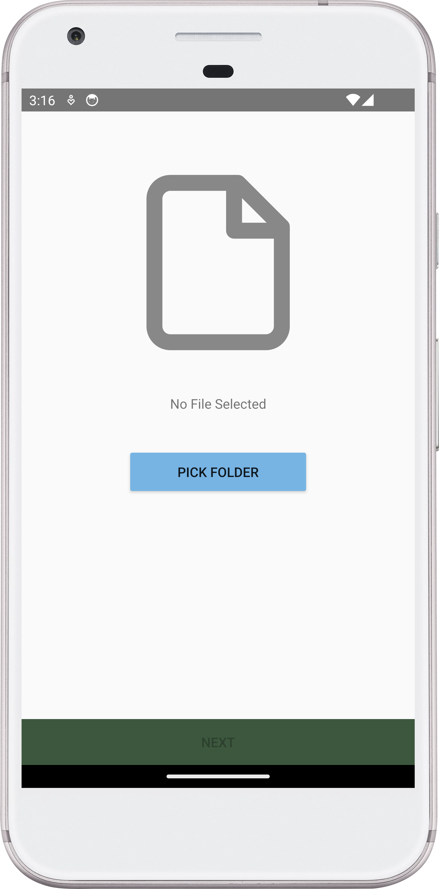
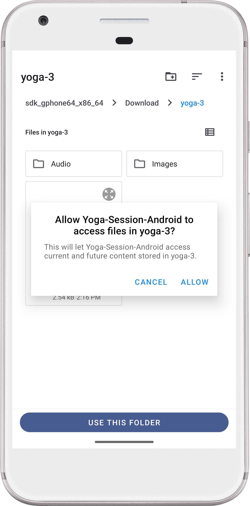
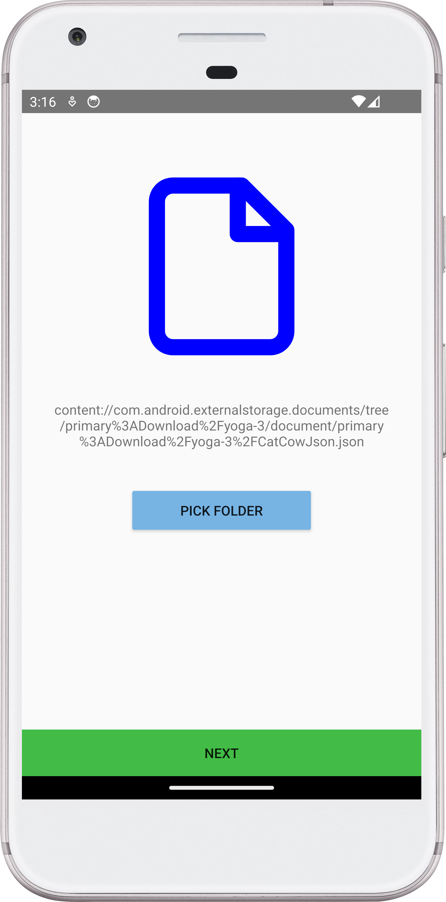
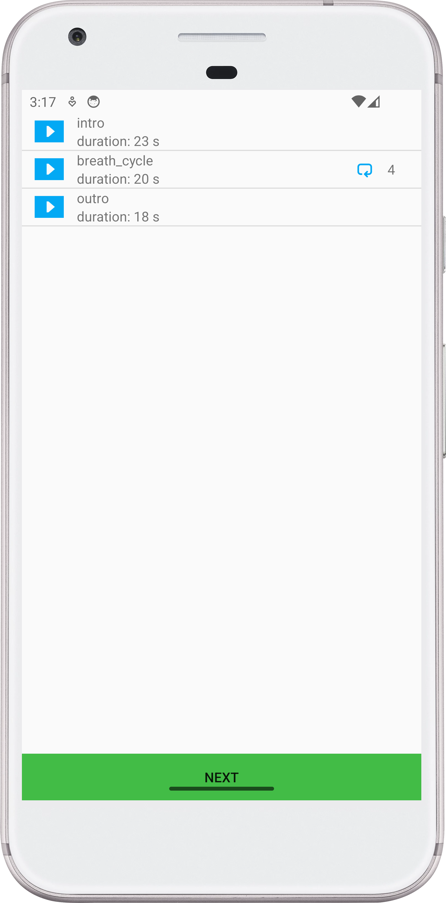
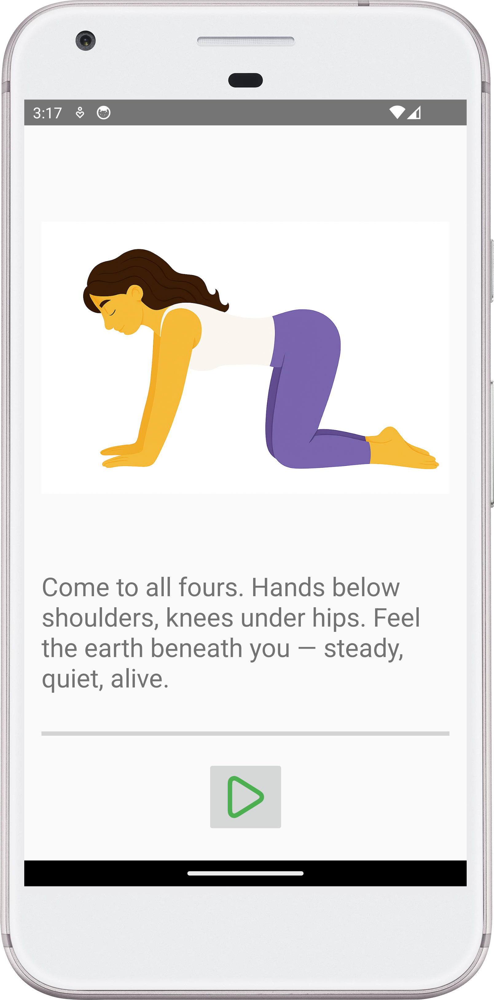
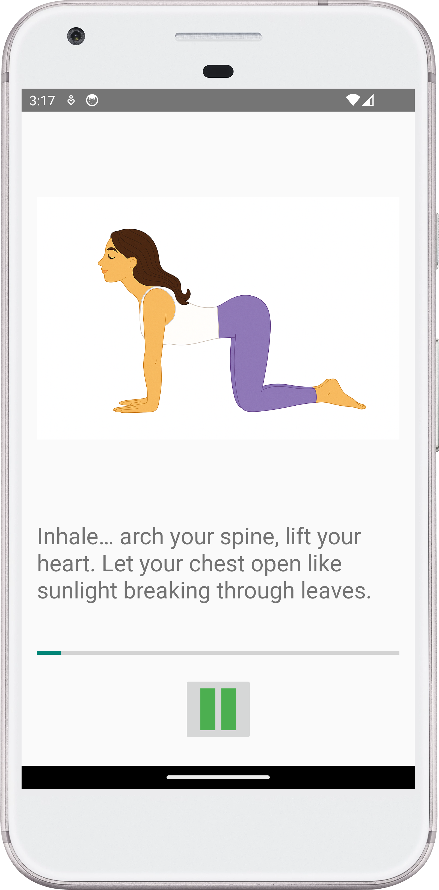
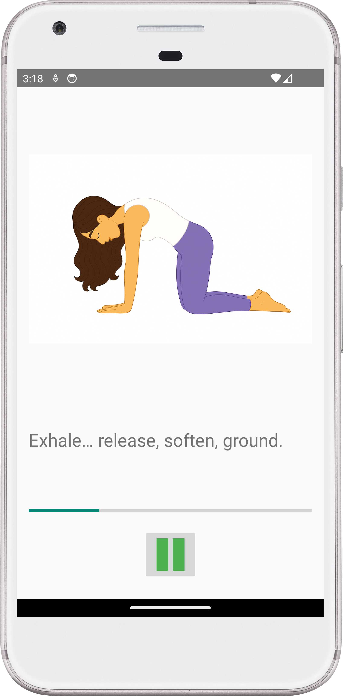

# yoga_session

A prototype mobile app in Android (Kotlin) that plays a guided yoga session, syncing images, audio, and pose metadata (from JSON).

## Resources
- poses.json  
  – contains metadata, assets, poses sequence
- Images/  
  – visual images for yoga poses
- Audio/  
  – spoken guidance for each pose

## Features
- Read & parse the JSON file
- Preview all poses in the session before starting
- Display a guided yoga session
- Add play/pause/resume
- Show progress bar

## Screenshots

